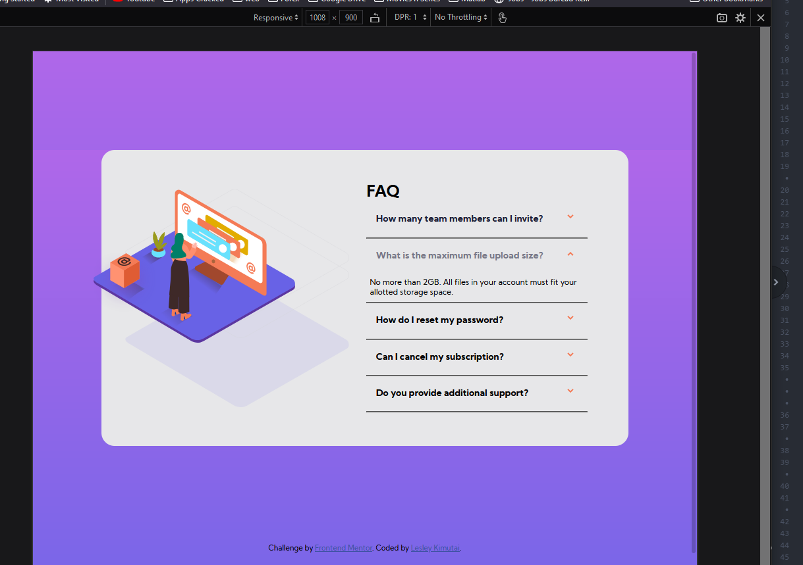
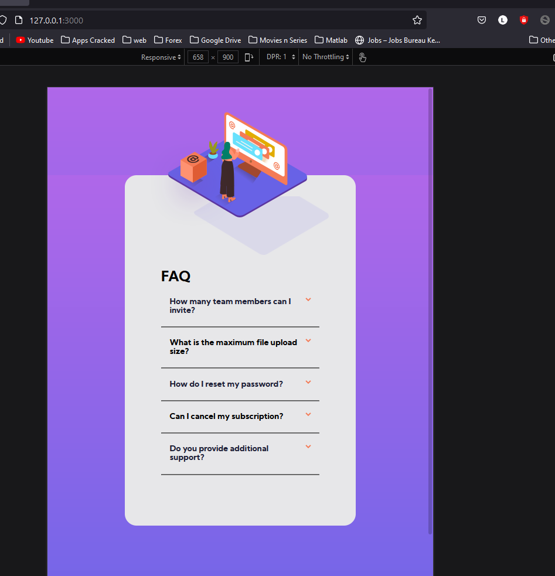
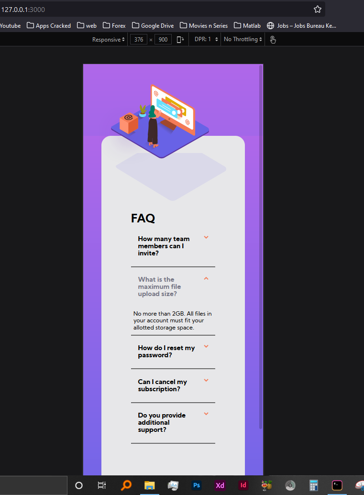

# Frontend Mentor - FAQ accordion card solution

This is a solution to the [FAQ accordion card challenge on Frontend Mentor](https://www.frontendmentor.io/challenges/faq-accordion-card-XlyjD0Oam). Frontend Mentor challenges help you improve your coding skills by building realistic projects.

## Table of contents

- [Overview](#overview)
  - [The challenge](#the-challenge)
  - [Screenshot](#screenshot)
  - [Links](#links)
- [My process](#my-process)
  - [Built with](#built-with)
  - [What I learned](#what-i-learned)
  - [Continued development](#continued-development)
- [Author](#author)

## Overview

### The challenge

Users should be able to:

- View the optimal layout for the component depending on their device's screen size
- See hover states for all interactive elements on the page
- Hide/Show the answer to a question when the question is clicked

### Screenshot



Laptop view of solution done : 😁 Not quite there yet



Tablet view of solution : quirks in the handling of images at this level



Mobile view of solution ----- image background handling not 💯

### Links

- Solution URL: [Add solution URL here](https://github.com/issagoodlifeInc/faq-accordion.git)
- Live Site URL: [Add live site URL here](https://issagoodlifeinc.github.io/faq-accordion/)

## My process

### Built with

- Semantic HTML5 markup
- CSS custom properties
- Flexbox
- CSS Grid
- Laptop-first workflow

### What I learned

My knowledge of javascript is shallow, had no clue how to create classes to help in the accordion dropdown ....had to use a timeout to handle that ...

To see how you can add code snippets, see below:

Not proud of this js code :- need help to deal with this :::

```js
for (let i = 0; i <= seeContent.length; i++) {
  seeContent[i].addEventListener('click', function() {
    console.log("i'm clicked!!");

  seeContent[i].style.transform = "rotateX(180deg)";
  faqHead[i].style.color = "var(--darkgrayishblue)";
  faqContent[i].style.visibility = "visible";
  faqContent[i].style.display = "block";

    // seeContent.forEach(function(content){
    //   content.show(".faqContent");
    setTimeout(function(){
      seeContent[i].style.transform = "rotateY(180deg)";
      faqHead[i].style.color = "var(--verydarksatblue)";
      faqContent[i].style.visibility = "hidden";
      faqContent[i].style.display = "none";

    },3000);
  });
}
}
```

### Continued development

My Javascript handling of events on the page needs to improve quite a lot

Mobile first workflow for ease of page making so as not to use a lot of media queries

Not throwing paddings needlessly for page perfection

General handling of markup Used a lot of unnecessary divs

## Author

- Website - [Us](https://leskimfamily.herokuapp.com/)
- Frontend Mentor - [@Leskim](https://www.frontendmentor.io/profile/@Leskim)
- Instagram - [@lesleykimutai](https://www.instagram.com/lesleykimutai/)

*
